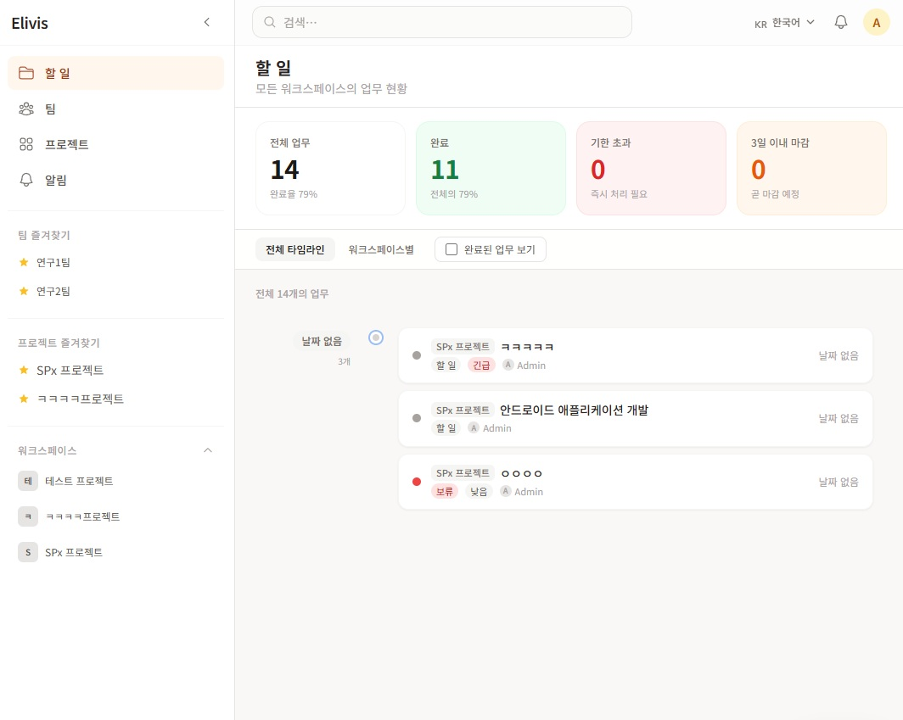
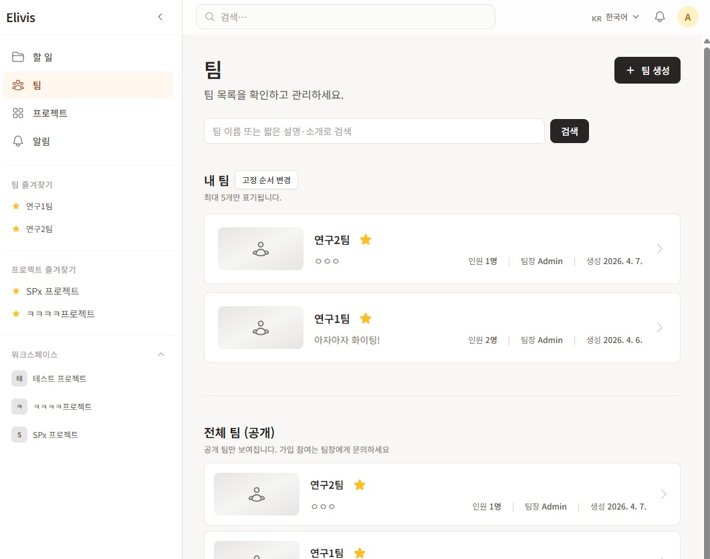
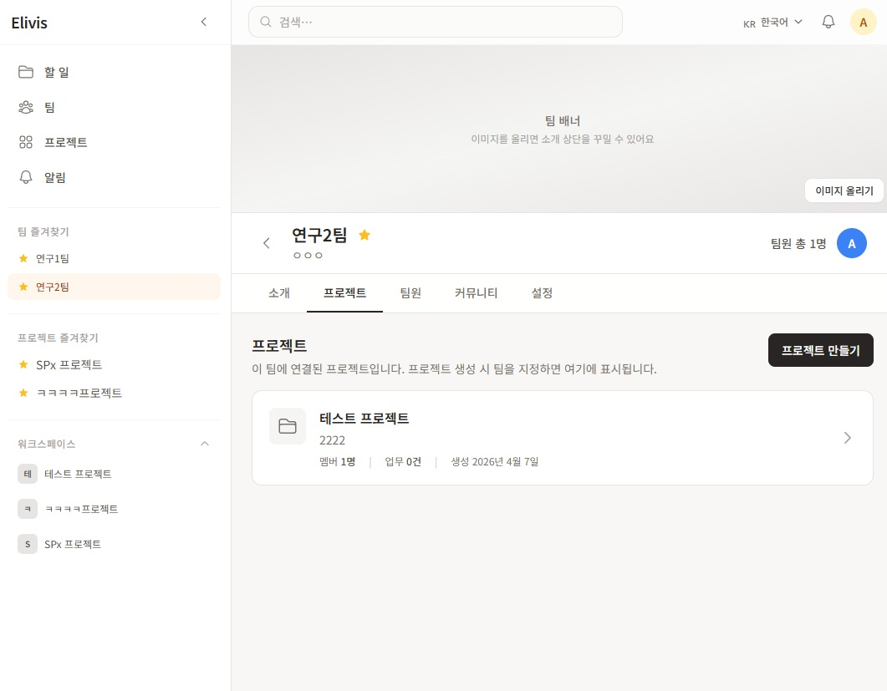
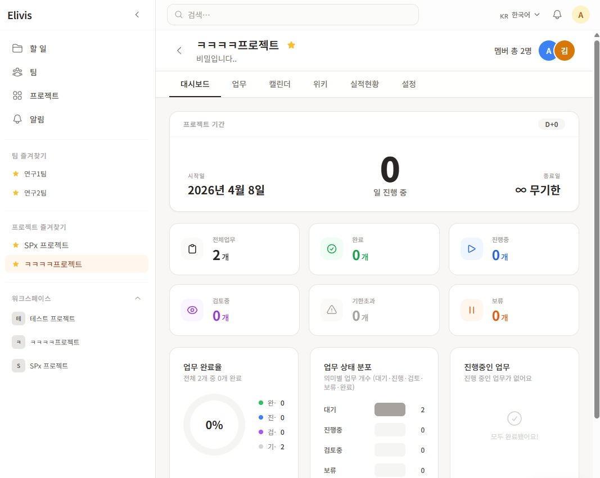
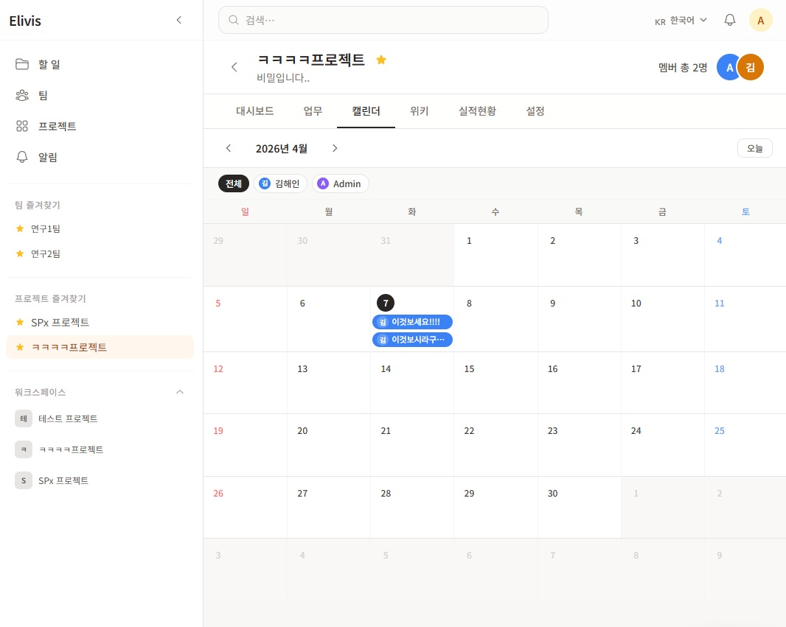
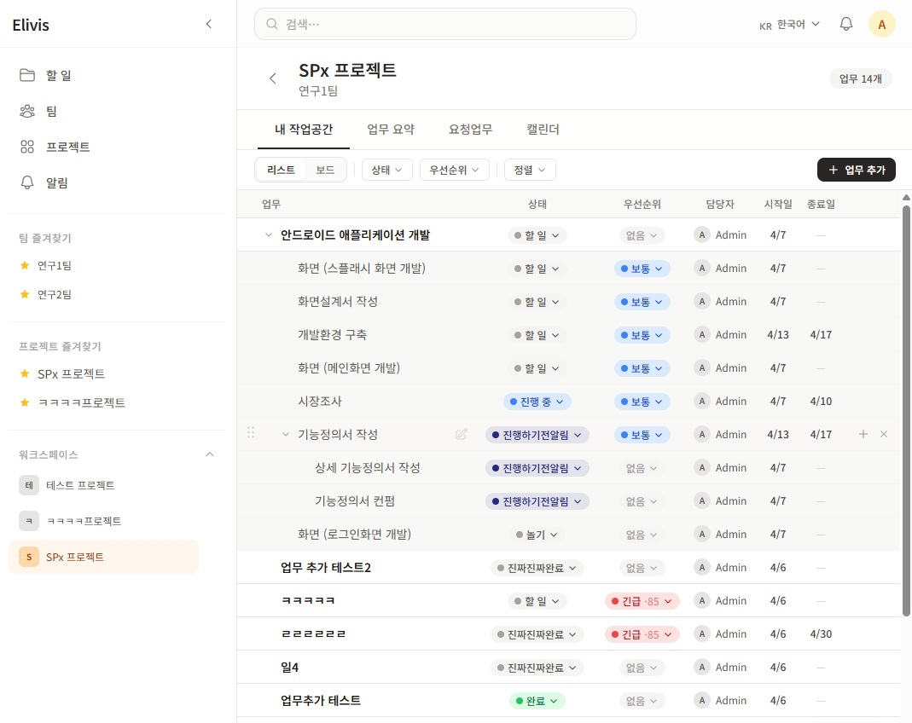
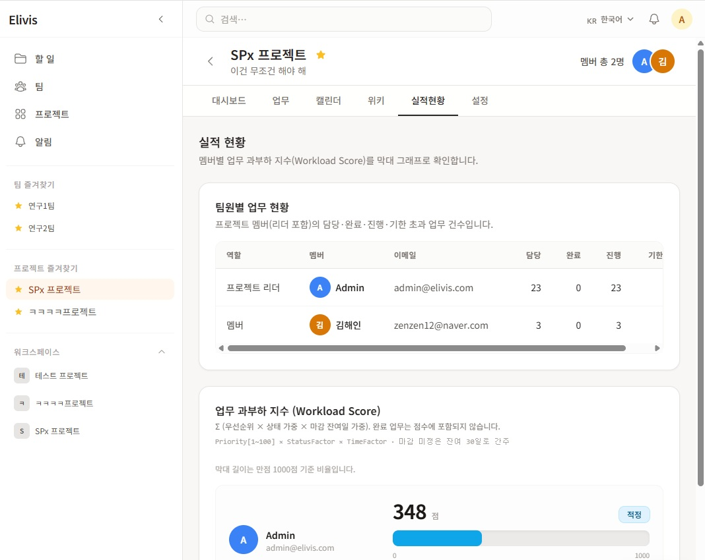

<p align="center">
  
</p>

<h1 align="center">Elivis</h1>

<p align="center">
  <strong>Team, project, and task management focused on real workflows.</strong><br />
  Same UI on web and desktop, built for <strong>self-hosting</strong> on your own infrastructure.
</p>

<p align="center">
  <a href="#license"></a>
  <a href="https://github.com/haeinkkk/elivis"></a>
  <a href="docs/README.md"></a>
  <a href="docs/en/README.md"></a>
</p>

<p align="center">
  한국어: <a href="README.md"><strong>README.md</strong></a> · <a href="docs/README.md"><strong>Documentation</strong></a>
</p>

### Made by

Built by me — updates and behind-the-scenes on these channels too.

[](https://www.instagram.com/hi.kimsunim/)
[](https://www.threads.com/@hi.kimsunim)

---

## Table of contents

- [Screenshots](#screenshots)
- [Key features](#key-features)
- [Tech stack](#tech-stack)
- [Prerequisites](#prerequisites)
- [Quick start](#quick-start)
- [Usage](#usage)
- [Common commands](#common-commands)
- [Repository layout](#repository-layout)
- [Documentation](#documentation)
- [Contributing](#contributing)
- [License](#license)

---

## Screenshots

<details>
<summary><strong>Expand screenshots</strong></summary>

<p align="center">
  
</p>
<p align="center">
  
</p>
<p align="center">
  
</p>
<p align="center">
  
</p>
<p align="center">
  
</p>
<p align="center">
  
</p>
<p align="center">
  
</p>

</details>

---

## Key features

- Create **teams**, invite members, and discuss on a per-team **community board**.
- Create **projects**, manage members and roles; each person gets a **personal workspace** (my work board).
- Team members **capture, create, and manage** work in their **personal workspace**.
- Tasks support **status and priority**, comments, attachments, notes, and **task requests** (accept / reject).
- Team leads can review **work-overload indicators** and **balance** work across members.

For architecture, API details, and build options, see **[`docs/en/`](docs/en/README.md)**.

---

## Tech stack

| Area | Technology |
| ---- | ---------- |
| Monorepo | pnpm workspaces, Turborepo |
| Web | Next.js 16, React 19, Tailwind CSS |
| Desktop | Electron 41 |
| API | Fastify 5, Node.js 24+ |
| Notifications | Socket.IO, Redis Pub/Sub |
| Database | PostgreSQL 16, Prisma 6 |
| Cache / sessions | Redis 7 |
| Auth | JWT (access / refresh) + RBAC |

---

## Prerequisites

| Tool | Version |
| ---- | ------- |
| Node.js | 24.14.0+ (see `package.json` `engines`) |
| pnpm | 9.x (`corepack enable` recommended) |
| Docker Desktop | Latest (local PostgreSQL & Redis) |

---

## Quick start

**1. Before you install**

```bash
git clone https://github.com/haeinkkk/elivis.git
cd elivis
```

- **Tooling** — Meet the **Prerequisites** above (Node.js, pnpm, Docker).
- **Environment**

```bash
# macOS / Linux
cp env.example .env

# Windows (PowerShell)
Copy-Item env.example .env
```

In `.env`, set `JWT_ACCESS_SECRET` and `JWT_REFRESH_SECRET` to long random values (e.g. `openssl rand -hex 32`).

- **Docker** — Start Docker Desktop (or the Docker engine) **before** running setup.

**2. One-shot setup**

Typing only `pnpm setup` runs pnpm’s **built-in** command — use the rows below instead.

| OS | Command |
| -- | ------- |
| **macOS / Linux** | `pnpm run setup:mac` |
| **Windows** | `pnpm run setup:win` |

This runs `pnpm install`, starts Postgres and Redis in Docker, and applies Prisma migrations.

**3. Development**

```bash
pnpm dev
```

| Service | URL |
| ------- | --- |
| Web | http://localhost:3000 |
| REST API | http://localhost:4000 |
| Notifications (Socket.IO) | http://localhost:4001 (web uses `NEXT_PUBLIC_NOTIFICATION_URL`) |
| Desktop | Electron window (starts after the web app is ready with `pnpm dev`) |

### Google Workspace OIDC login (optional)

To enable Google sign-in, add these keys to the root `.env`. For the full server-side guide, see [`docs/en/server/README.md`](docs/en/server/README.md#google-workspace-oidc-optional).

| Key | Description |
| --- | --- |
| `GOOGLE_OIDC_ENABLED` | Attempts to enable Google login routes when set to `true` |
| `GOOGLE_OIDC_CLIENT_ID` | Google Cloud OAuth client ID |
| `GOOGLE_OIDC_CLIENT_SECRET` | Google Cloud OAuth client secret |
| `GOOGLE_OIDC_REDIRECT_URI` | API callback URL registered in Google Cloud. Example: `http://localhost:4000/api/auth/google/callback` |
| `GOOGLE_OIDC_ALLOWED_DOMAINS` | Allowed Google Workspace email domains (comma-separated) |
| `GOOGLE_OIDC_SCOPES` | The current default is `openid email profile`, and the server currently uses that fixed scope set |
| `WEB_PUBLIC_URL` | Base web-app URL the API redirects back to after login. Example: `http://localhost:3000` |

The Google sign-in button only appears when **all required env values are valid and the first `SUPER_ADMIN` already exists**.

---

## Usage

1. **First account** — When there are no users, the API logs a `SETUP TOKEN`. Sign up with `setupToken` in the body to create **SUPER_ADMIN**. After that, normal signup / invite flows apply. ([Details: `docs/en/server/README.md` — Bootstrap](docs/en/server/README.md#bootstrap-super_admin))

   Even with Google Workspace OIDC configured, the **first `SUPER_ADMIN` must still be created with the setup token first** before Google sign-in is shown.

2. **Browser** — Open http://localhost:3000 and sign in. Teams, projects, my work, notifications, and settings live under the App Router. ([`docs/en/web/README.md`](docs/en/web/README.md))

3. **Desktop** — With the web dev server on port 3000, `pnpm dev` also launches Electron. For installers, run the static web build then package the desktop app. ([`docs/en/desktop/README.md`](docs/en/desktop/README.md))

4. **Admins** — `SUPER_ADMIN` uses the admin UI for users and roles. ([`docs/en/server/README.md`](docs/en/server/README.md))

5. **Production** — Prepare `.env.production` and use the production Docker Compose flow. ([`docs/en/server/README.md` — Production](docs/en/server/README.md#production-builds))

---

## Common commands

| Command | Description |
| ------- | ----------- |
| `pnpm run setup` | Install + Docker (DB / Redis) + Prisma migrations |
| `pnpm run setup:mac` | Same (macOS / Linux; needs `bash`) |
| `pnpm run setup:win` | Same (Windows PowerShell) |
| `pnpm --filter @repo/database db:setup` | DB only: Prisma generate + migrate dev |
| `pnpm --filter @repo/database db:migrate` | migrate dev only (interactive) |
| `pnpm db:deploy` | migrate deploy + generate (deployments) |
| `pnpm dev` | Web, API, notifications, desktop in dev mode |
| `pnpm dev:web` / `pnpm dev:server` / `pnpm dev:notification` / `pnpm dev:desktop` | Single app |
| `pnpm build` | Build all packages |
| `pnpm build:desktop` | Static web + Electron installer |
| `pnpm start` | After build: web + API + notification servers |
| `pnpm db:studio` | Prisma Studio |
| `pnpm docker:dev:*` / `pnpm docker:prod:*` | Dev / prod Docker helpers |

---

## Repository layout

```
apps/
  web/                 # Next.js
  desktop/             # Electron
  server/
    apiServer/         # REST API
    notificationServer/ # Socket.IO + Redis
packages/
  database/            # Prisma
  ui/, types/, i18n/   # Shared packages
docs/                  # Deep dives (Korean: docs/, English: docs/en/)
```

---

## Documentation

**한국어:** [Docs index](docs/README.md) · [Server](docs/server/README.md) · [Web](docs/web/README.md) · [Desktop](docs/desktop/README.md)

**English:** [Docs index](docs/en/README.md) · [Server](docs/en/server/README.md) · [Web](docs/en/web/README.md) · [Desktop](docs/en/desktop/README.md)

---

## Contributing

Issues and PRs are welcome. For larger changes, opening an issue first helps align direction.

1. Fork and create a branch
2. Commit and push
3. Open a pull request

---

## License

MIT License

Copyright (c) 2026 Elivis Contributors

Permission is hereby granted, free of charge, to any person obtaining a copy
of this software and associated documentation files (the "Software"), to deal
in the Software without restriction, including without limitation the rights
to use, copy, modify, merge, publish, distribute, sublicense, and/or sell
copies of the Software, and to permit persons to whom the Software is
furnished to do so, subject to the following conditions:

The above copyright notice and this permission notice shall be included in all
copies or substantial portions of the Software.

THE SOFTWARE IS PROVIDED "AS IS", WITHOUT WARRANTY OF ANY KIND, EXPRESS OR
IMPLIED, INCLUDING BUT NOT LIMITED TO THE WARRANTIES OF MERCHANTABILITY,
FITNESS FOR A PARTICULAR PURPOSE AND NONINFRINGEMENT. IN NO EVENT SHALL THE
AUTHORS OR COPYRIGHT HOLDERS BE LIABLE FOR ANY CLAIM, DAMAGES OR OTHER
LIABILITY, WHETHER IN AN ACTION OF CONTRACT, TORT OR OTHERWISE, ARISING FROM,
OUT OF OR IN CONNECTION WITH THE SOFTWARE OR THE USE OR OTHER DEALINGS IN THE
SOFTWARE.
